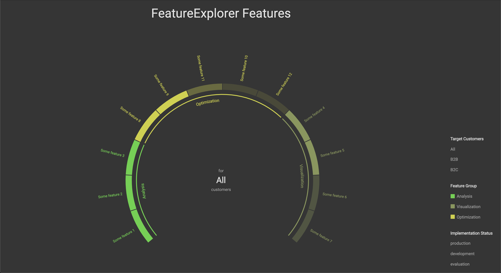

# FeatureExplorer

This is a tiny side project to interactively visualize the features of a product in your browser.
The goal is to make it easier to get an overview of the feature set of a product and make it easy and fun to explore it.

Check out the demo at https://buildeazy-gmbh.github.io/feature-explorer/!



The app takes data in the following format

```
[
  {
    name: 'Some feature 1',
    group: 'Analysis',
    status: 'development',
    customers: ['B2C'],
  },
  ...
]
```

to render a visualization of features grouped by feature group.

The visualization can be filtered by

- Target customers
- Feature group
- Implementation status (`evaluation`, `planned`, `development`, or `production`)

Out of the box, the app renders the features from `/data/featureData.ts`, which contains some demo data for illustration.
Either replace the data in that file or add another file with your feature data and pass it into the FeatureExplorer component.

## Installing and running the app

The app works like any other [Create React App (CRA)](cra) app.

After you have checked out the repository, you first have to install its dependencies with

```bash
$ yarn install
```

Then you can run the app locally with

```bash
$ yarn start
```

It will automatically open a new window in your browser that displays the app.

<!-- Markdown link definitions -->

[cra]: https://github.com/facebook/create-react-app
